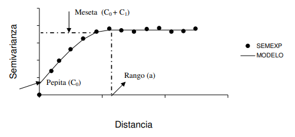

  
  ```{r setup, include=FALSE}
knitr::opts_chunk$set(echo = FALSE)
```


# Estadística Espacial

Conjunto de metodología utilizadas para el análisis de datos que corresponden a la medición de variables aleatorias indexadas en el espacio $S \subset \mathbb{R}^d$. Se va a trabajar con un espacio aleatorio $\{Z(s): s\in D \subset \mathbb{R}^d \}$

# Campos de la Estadística Espacial

* Geoestadística: El conjunto $D$ es fijo y de tipo continuo. 
* Datos de área: $D$ es fijo y discreto.
* Patrones puntuales: $D$ es discreto o continuo, pero es aleatorio (la selección de las locaciones de medición no dependen del investigador).

# Geoestadística

Sea $\{Z(s): s\in D\}$ un campo aleatorio observado en las locaciones $s_1, s_2, \dots, s_n$ y su correspondiente vector de mediciones de la variable de interés $\mathbf{Z}(\mathbf{s})= \left[ Z(s_1), Z(s_2), \dots, Z(s_n) \right]'$.

La muestra de mediciones $\mathbf{Z}(\mathbf{s})$ es una observación incompleta de una superficie, cuyo dominio es $D$.

El objetivo de esta área es realizar predicciones en sitios no muestreados, teniendo en cuenta dos etapas. 

  + Realizar un análisis estructural, que sirve para modelar la estructura de correlación entre puntos en el espacio.
  + Obtener las predicciones en sitios de la región no muestreados mediante metodologías kriging. 
  
# Notación y supuestos básicos

_"everything is related to everything else, but near things are more related than distant things"_


# Notación y supuestos básicos

* $\mathbf{Z}(\mathbf{s}) =\boldsymbol{\mu} (\mathbf{s}) + \mathbf{e}(\mathbf{s})$ con $e(\mathbf{s}) \sim (\mathbf{0}, \boldsymbol{\Sigma})$

<!-- * $E[Z(s_i)] = \mu (s_i)$. -->
<!-- * $Var(Z(s_i)) = E[(Z(s_i)-\mu(s_i))^2]=\sigma^2_i$. -->

* $E[\mathbf{Z}(\mathbf{s})] = \boldsymbol{\mu} (\mathbf{s})$ 
* $Var(\mathbf{Z}(\mathbf{s})) = \boldsymbol{\Sigma}$
* Función de autocovarianza : 

\begin{align}
C(Z(s_i), Z(s_j))&= E[(Z(s_i)-\mu(s_i))(Z(s_j)-\mu(s_j))]= C_{ij}
\end{align}

* Función de semivariograma :

\begin{align}
\gamma(Z(s_i), Z(s_j))&= \frac{1}{2} E[(Z(s_i) - Z(s_j))^2]
\end{align}


# Estacionariedad de segundo orden

Sea $\{Z(s): s\in D\}$ un campo aleatorio. Se dice que $Z(s)$ es estacionario de segundo orden si cumple:

a. $E[Z(s)]= \mu$ $\forall s \in D \subset \mathbb{R}^d$.
b. $Cov[ Z(s), Z(s+h)] = C(h) < \infty$

La existencia de la función de covarianza implica que la varianza existe, es finita y no depende del rezago $h$

# Estacionariedad débil o intrínseca

Es un supuesto que se utiliza cuando la varianza del proceso no es finita. En este caso se trabaja con la hipótesis correspondiente a los incrementos $Z(s+h)-Z(s)$ sean estacionarios. 

a. $E[Z(s+h)-Z(s)]=0$

b. $V[Z(s+h)-Z(s)] = 2\gamma(h)$


# Métodos kriging -  Kriging ordinario
Se usa cuando la variable de interés es al menos estacionaria intrínseca y tiene media constante pero desconocida. 

$$\mathbf{Z}(\mathbf{s})= \mu \mathbf{1}+\mathbf{e}(\mathbf{s}),$$
Con $E[\mathbf{Z}(\mathbf{s})] =  \mu \mathbf{1}$. El predictor de $KO$ en una locación no observada $s_0$ viene dado de la forma $Z^*(s_0) = \sum_{l=1}\lambda_l Z(s_l)$. Para que el predictor sea insesgado se requiere que $\sum_{l=1}^n \lambda_l =1$.


# Kriging ordinario

Para encontrar los valores de $\boldsymbol{\lambda}$ se debe minimizar el cuadrado medio del error, dado a continuación

$$ E[(\boldsymbol{\lambda}' \mathbf{Z}(\mathbf{s})-Z(s_0))^2],$$
sujeto a $\boldsymbol{\lambda}'\mathbf{1}=1$. Es decir que la expresión a minimizar es 

\begin{align}
Q&=E[(\boldsymbol{\lambda}'\mathbf{Z}(\mathbf{s}))^2]-2E[Z(s_0)\boldsymbol{\lambda}'\mathbf{Z}(\mathbf{s})]+E[Z(s_0)^2]-2m(\boldsymbol{\lambda}'\mathbf{1}-1) \\
&= C(\mathbf{0})+ \boldsymbol{\lambda}' \boldsymbol{\Sigma} \boldsymbol{\lambda} -2\boldsymbol{\lambda}' \boldsymbol{\sigma}-2m(\boldsymbol{\lambda}'\mathbf{1}-1)
\end{align}


# Kriging ordinario

$$ \boldsymbol{\lambda}' = \left( \boldsymbol{\sigma}+ \mathbf{1}\frac{1-\mathbf{1}' \boldsymbol{\Sigma}^{-1}\boldsymbol{\sigma}}{\mathbf{1}' \boldsymbol{\Sigma}^{-1}\mathbf{1}} \right)' \boldsymbol{\Sigma}^{-1}$$
$$ m = \frac{1-\mathbf{1}' \boldsymbol{\Sigma}^{-1}\boldsymbol{\sigma}}{\mathbf{1}' \boldsymbol{\Sigma}^{-1}\mathbf{1}}$$

$$ Z^*(s_0) = \hat{\mu}+\boldsymbol{\sigma}' \boldsymbol{\Sigma}^{-1}(\mathbf{Z}(\mathbf{s})-\mathbf{1}\hat{\mu})$$

$$\sigma^2_{ok}(s_0) = C(\mathbf{0})-\boldsymbol{\lambda}'\boldsymbol{\sigma}+m$$

# Semivariograma

La expresión utilizada para el predictor $KO$ requiere conocer la matriz $\boldsymbol{\Sigma}$, en la que se tiene en cuenta la estructura de autocorrelación espacial. Para ello, se tiene en cuenta la relación existente entre el semivariograma y la autocovarianza del proceso. Haciendo uso de la propiedad de media constante, se tiene la siguiente relación 

\begin{align}
\gamma(\mathbf{h}) &= \frac{1}{2} Var(Z(\mathbf{h})-Z(\mathbf{s}+\mathbf{h})) \\
&= \frac{1}{2}\left[Var(Z(s))+Var(Z(\mathbf{s}+\mathbf{h}))-2Cov(Z(\mathbf{s},Z(\mathbf{s}+\mathbf{h}))) \right] \\
&= C(\mathbf{0})-C(\mathbf{h})
\end{align}


# Estimación del semivariograma

El semivariograma empírico se puede estimar de la manera 

$$ \bar{\gamma}(\mathbf{h}) = \frac{\sum (Z(s+h)-Z(s))^2}{2n(h)} $$


# Estimación del semivariograma



# Modelos teóricos del semivariograma

* Efecto pepita : Se denota por $C_0$ y representa una discontinuidad puntual de la función $\gamma(\mathbf{h})$ en el origen.

* Meseta: Es la cota superior del semivariograma. 

* Rango: Corresponde a la distancia a partir de la cual dos observaciones son independientes. Se puede interpretar como una zona de influencia. 

# Funciones de correlación espacial

La primer etapa del proceso, antes de realizar la predicción requiere de lo que se denomina como análisis estructural, donde se describe la dependencia espacial del proceso. La idea en esta etapa es ajustar un modelo teórico a partir del semivariograma empírico. 

Para realizar la estimación de los parámetros del modelo teórico se requieren valores iniciales, para lo cual se utiliza el modelo empírico.

# Métodos kriging - Kriging simple

$$\mathbf{Z}(\mathbf{s}) = \boldsymbol{\mu}(\mathbf{s})+\mathbf{e}(\mathbf{s})$$

$$Z^*_{sk}=\lambda_0 +\boldsymbol{\lambda}'\mathbf{Z}(\mathbf{s})$$


$$\lambda_0 = \mu(\mathbf{s}_0)-\boldsymbol{\lambda}' \boldsymbol{\mu}(\mathbf{s}) $$

$$ \boldsymbol{\lambda} = \boldsymbol{\Sigma}^{-1}\boldsymbol{\sigma} $$

\begin{align}
Z^*_{sk} &= \lambda_0 +\boldsymbol{\lambda}'\mathbf{Z}(\mathbf{s}) \\
&= \mu (\mathbf{s}_0)+\boldsymbol{\sigma}' \boldsymbol{\Sigma}^{-1} (\mathbf{Z}(\mathbf{s})-\boldsymbol{\mu}(\mathbf{s}))
\end{align}